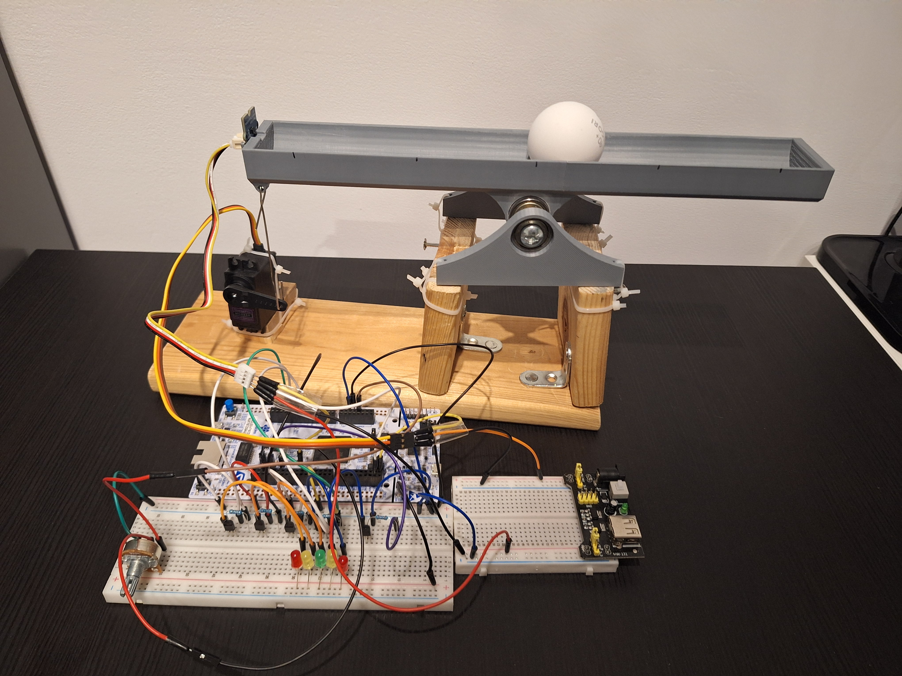

# Ball on Beam

## O projekcie

Celem projektu było stworzenie systemu automatycznego balansowania kulki na belce z wykorzystaniem sterowania automatycznego. Wykorzystano:

- **Regulator PID**
- **Czujnik odległości** VL53L0X
- **Serwomechanizm** do pochylania belki
- **Aplikację desktopową** do wizualizacji i strojenia parametrów

## Konstrukcja oraz aplikacja desktopowa

